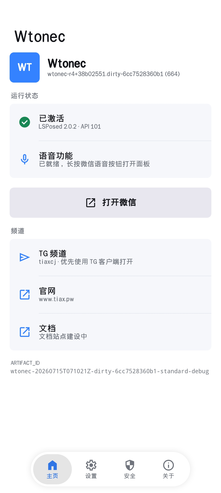
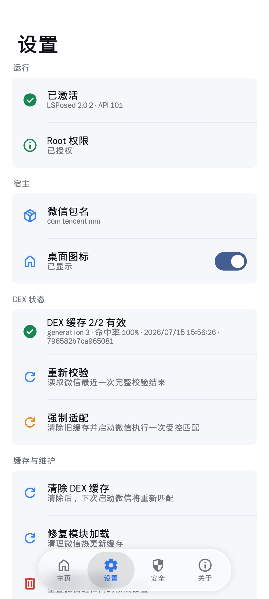
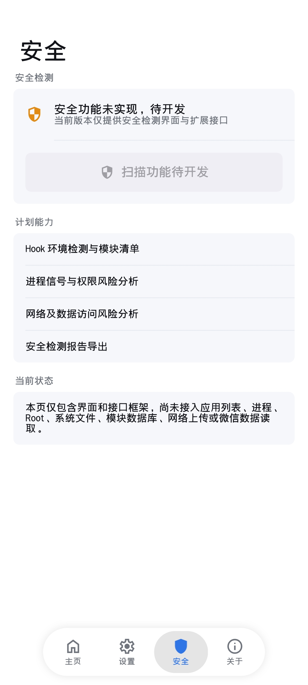
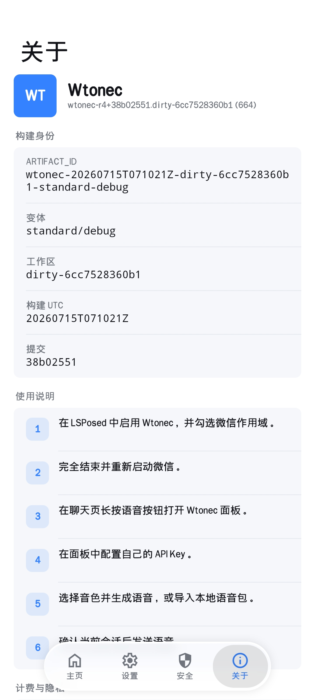

# Wtonec 文档

Wtonec 是独立维护的 Android 微信语音工具。本目录覆盖从安装、激活、DEX 匹配、API Key 配置到语音生成、数据备份和问题定位的完整流程。

## 初次使用

1. [安装与首次启动](GETTING_STARTED.md)
2. [API Key 获取与配置](API_KEY.md)
3. [预设、克隆与语音包使用教程](USAGE.md)

## 数据与诊断

- [数据目录、文件类型、备份与清理](STORAGE.md)
- [隐私与网络请求](PRIVACY.md)
- [故障排查](TROUBLESHOOTING.md)
- [使用说明与责任边界](DISCLAIMER.md)

## 项目资料

- [公开样例范围](PUBLIC_SOURCE_SCOPE.md)
- [公开 Kotlin 样例](../examples/android-kotlin/README.md)
- [Xposed 官方仓库与同步说明](XPOSED_REPOSITORY.md)
- [Xposed 官方版本发布](https://github.com/Xposed-Modules-Repo/dev.wtonec/releases)
- [项目归档版本](https://github.com/tianxing226/wtonec/releases)
- [功能介绍页](https://tianxing226.github.io/wtonec/)

## 界面速览

<p>
  
  
  
  
</p>

标准微信的数据根目录为：

```text
/storage/emulated/0/Android/data/com.tencent.mm/Wtonec/
```

安全页当前用于呈现接口框架和开发状态，扫描执行逻辑处于后续开发阶段。
